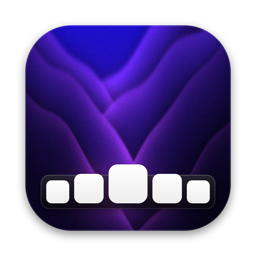
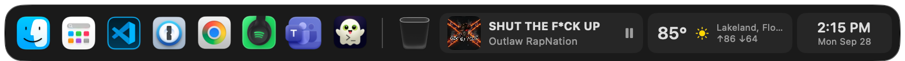

<p align="center">
  
</p>

<h1 align="center">DockIt</h1>

<p align="center">A Dock replacement for macOS.</p>

<p align="center">
  
</p>

DockIt draws its own Liquid Glass dock and keeps the macOS Dock hidden. The system Dock stays
running, because it also draws Cmd-Tab, Mission Control and Spaces; DockIt just keeps it out of
sight.

## Features

- **Pinned and running apps**, with Finder always first and the Trash at the end. Drag icons to
  reorder them, drop apps on the dock to pin them, and drop files on an app to open them with it.
- **Badges.** Unread counts from Mail, Messages, Slack and other apps show on their icons, as
  they do in the macOS Dock.
- **Window previews.** Rest the pointer on a running app to see its windows, then click one to go
  to it, even on another Desktop or display.
- **Minimized windows** sit beside the Trash as their own snapshot tiles, as in the macOS Dock.
- **Widgets:** now playing (Spotify and Music, with playback controls), weather and a clock. You
  can reorder them by dragging.
- **Stacks** for folders such as Downloads, and **spacers** to group icons.
- **Magnification**, with adjustable amount and reach, and an option to start growing as the
  pointer approaches.
- **Auto-hide**, with adjustable sensitivity, delay and speed.
- **Multiple displays:** follow the pointer, stay on the primary display, pick one, or show a dock
  on every display.
- **Appearance:** bottom, left or right edge, icon size, bar tint, corner radius, icon shadows and
  running-app dots.
- **Settings sync** through iCloud Drive, plus import and export.
- **Automatic updates** through Sparkle.
- **VoiceOver.** Every icon, minimized window and widget is labelled and can be pressed, and the
  now playing widget offers next and previous track actions.

## Requirements

macOS 26 or later, on Apple silicon or Intel.

## Install

Download the latest release from
[Releases](https://github.com/kdbaustert/DockIt/releases), unzip it, and move `DockIt.app` to
`/Applications`. DockIt checks for updates daily and installs them when you ask.

Releases are not notarized yet, so the first launch needs right-click → **Open**, or
`xattr -cr /Applications/DockIt.app` in Terminal. Updates after that arrive through Sparkle, which
checks each one against the release signing key.

### Permissions

DockIt asks for these when it first needs them. You can review them under **Settings › General ›
Permissions**.

- **Screen Recording** to show window previews.
- **Accessibility** to restore, close and switch to specific windows, and to show app badges.
- **Automation** to control Finder (emptying the Trash) and Spotify or Music (the now playing
  widget).

## Privacy

No telemetry, analytics, crash reporting, or account. DockIt makes only these network requests:

- The daily update check, which fetches the release feed from GitHub Pages and sends nothing
  about you or your Mac.
- If you turn on the weather widget, the city you enter goes to
  [Open-Meteo](https://open-meteo.com) to look up its forecast. The widget is off by default.

## Contributing

Issues and pull requests are welcome. To build and test:

```sh
./build.sh            # builds build/DockIt.app
./build.sh --install  # also copies it to /Applications and relaunches it
swift test            # the test suite; CI runs it on every push and pull request
```

Building needs Xcode 26 or later. Local builds leave out the update feed, so a development copy
never updates itself.

## License

DockIt is licensed under the [GNU General Public License v3.0](LICENSE).

Built by [@kdbaustert](https://github.com/kdbaustert).
